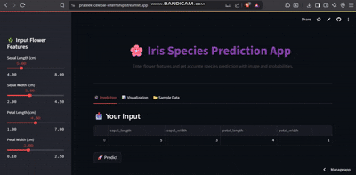

# 🌸 Iris Flower Classification Web App

A simple and elegant web application built using **Streamlit** that classifies iris flowers into three species: **Setosa, Versicolor**, and **Virginica**, using a trained machine learning model.

---

## 📌 Overview

This application predicts the **species** of an iris flower based on user inputs of petal and sepal dimensions. It provides quick predictions and visual insights using a trained classifier.

---

## 📂 Project Structure

```
Assignment7/
├── app.py
├── iris_model.pkl
├── project_video.gif
└── README.md
```

---

## 🚀 Features

- 🌸 Predicts **Iris Flower Species**  
- 📩 User-friendly sidebar for inputting flower measurements  
- 📊 Visuals include class distribution and prediction summary  
- ✅ Clean and interactive UI using **Streamlit**  
- 🧠 Powered by a trained **Logistic Regression** or **Random Forest** model  

---

## 🎥 Sample Prediction Demo



---

## 📊 Input Parameters

- `Sepal Length (cm)`  
- `Sepal Width (cm)`  
- `Petal Length (cm)`  
- `Petal Width (cm)`

---

## 🧠 Model Insights

- Predicts class probabilities for each flower species  
- Uses scikit-learn classifier trained on the Iris dataset  
- Interactive display of prediction results

---

## 🔧 Tech Stack

- Python  
- Streamlit  
- Scikit-learn  
- Pandas, Seaborn, Matplotlib  
- Joblib  

---

## 📦 How to Run

1. Clone this repo:
   ```
   git clone <repo-url>
   ```

2. Install dependencies:
   ```
   pip install -r requirements.txt
   ```

3. Run the app:
   ```
   streamlit run Assignment7/app.py
   ```

---

## 🌐 Live App

[https://iris-classifier-prateek.streamlit.app/](https://iris-classifier-prateek.streamlit.app/)

---

## 👨‍💻 Author

Made with ❤️ by **Prateek Agrawal**

